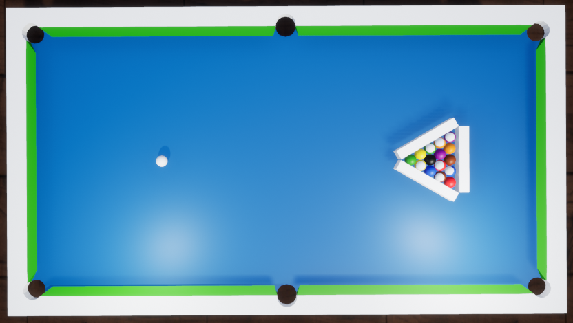

# Master-Thesis

Thesis title: Comparative analysis of Unreal Engine 4 and Unity real-time
engines, based on a game of billiards.

## Technologies:

* Unreal Engine 4
* Unity
* C++
* C#
* Blueprints
* Blender

## General Info

The same scenes and simulations were designed in both engines (Unity and UE4).

#### Simulation 1 - Rubber Cushions test

"Table cushions should influence the speed of the table such that with placement of a ball on the head spot, shooting through the foot spot, using center ball english, with a level cue and firm stroke, the ball must travel a minimum of 4 to 4 ½ lengths of the table without jumping." [source](https://wpapool.com/equipment-specifications/#Rail-and-Cushion)

Tested: Force Adding, Restitution Coefficient and Friction Coefficient (using Physical Materials)

#### Simulation 2 - Direct Impact

Tested: Velocity magnitude after the impact.

#### Sumulation 3 - Oblique Impact

Tested: Velocity magnitude after the impact. Angle between velocity vectors. Linear Drag, Angular Drag.

#### Simulation 4 - Break Shot

Tested: randomness, results on constant (high) FPS, and on low FPS (intendly overloaded CPU).

## Setup

You won't be able to run simulations, because the pooltable asset is not included in this repository.
I made this asset from scratch according to the WPA tournament specification.

If your interested in results of my work please contact my via e-mail I'll be happy to send you my thesis in PDF :)
Have a nice day!
